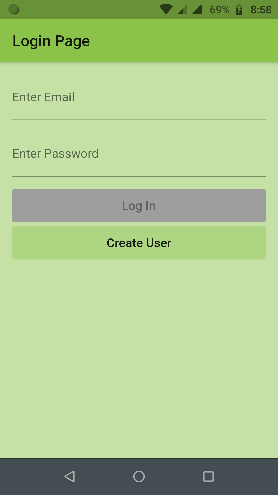
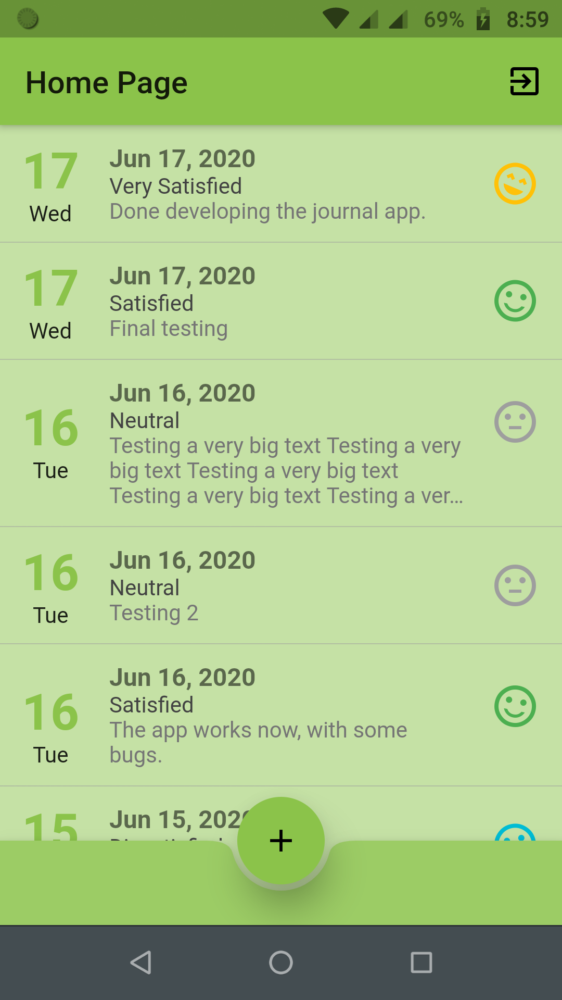
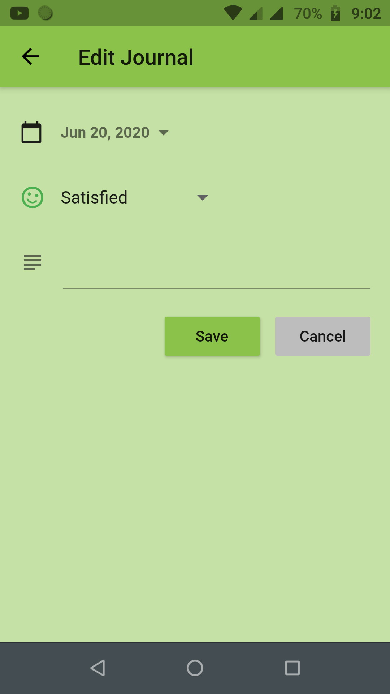

# journal

A new Flutter project that stores the journals.

## Info

- The project uses Cloud Firestore to store data
- Firebase Auth for authentication

## Getting Started

- To get started add the cloud firestore `google-services.json` to `android/app/` dir

## Images

|  |  |  |
| ----------------------------------------- | ---------------------------------------- | ---------------------------------------- |
